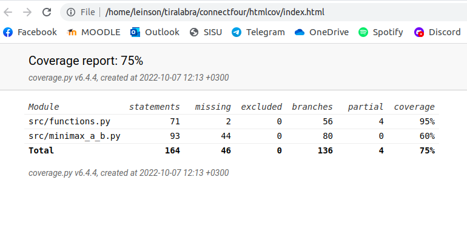

# Testausdokumentti
Ohjelmaa on testattu sekä manuaalisesti automatisoiduilla yksikkö- ja integraatiotesteillä läpi kehityksen.

## Yksikkö- ja integraatiotestaus

### Sovelluslogiikka
Sovelluslogiikasta vastaavat tiedostot ovat tällä hetkellä functions ja minimax_a_b. Näiden tiedostojen metodit ovat jaettu eri testiluokkiin tiedostoon functions_test.py: TestFunctions, TestCheckIfWin ja TestMiniMax.

### Testauskattavuus
Testauksen haarautumakattavuus on tällä hetkellä 75%. 

Näet viikkottaiset testikattavuusraportit dokumentaatio-kansion alakansiosta testikattavuus.

Käyttöliittymä on jätetty testikattavuuden ulkopuolelle. Käyttöliittymiä on tällä hetkellä kaksi: index.py toimii komentorivillä, ja ui.py pygamella graafisesti. Käyttöliittymällä toimiva jätetään jossain vaiheessa ohjelmasta pois.

### Järjestelmätestaus
Järjestelmätestausta on suoritettu manuaalisesti. 

### Asennus
Sovellusta on testattu Linux-ympäristössä, missä sovellus on kehitetty.

### Toiminnallisuudet ja sovellukseen jääneet laatuongelmat 
Testausta on aloitettu, mutta testit eivät vielä kata koko ohjelmaa.  Itse minimax funktion testaus on tällä hetkellä kesken, muuten testejä on tehty lähes kaikille funktioille ja haaroille. Virhesyötöillä saa vielä sovelluksen kaatumaan komentorivikäyttöliittymässä, tätä en kuitenkaan lähde korjaamaan koska poistan kyseisen käyttöliittymän lähiaikoina. 
Laatuongelmia täydennetään ja korjataan sovelluksen kehityskaaren aikana. 
 
