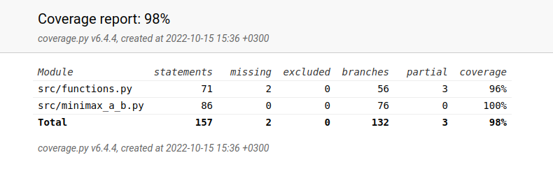

# Testausdokumentti

Ohjelmaa on testattu sekä manuaalisesti että automatisoiduilla yksikkötesteillä läpi kehityksen.

## Yksikkötestaus

### Sovelluslogiikan testaus
Sovelluslogiikasta vastaavat tiedostot ovat functions ja minimax_a_b. Näiden tiedostojen metodit ovat jaettu eri testiluokkiin tiedostoihin **functions_test.py**: TestFunctions ja TestCheckIfWin, ja **minimax_a_b_test.py**: TestMiniMax ja TestMiniMaxHelpFunctions.

Mitä on testattu, miten tämä tehtiin?

Testejä on pyritty tekemään mahdollisimman kattavasti. Jokaiselle funktiolle on tehty jokin testi, ja joillekin isommille funktioille on tehty useita testejä. 

Minkälaisilla syötteillä testaus tehtiin (vertailupainotteisissa töissä tärkeää)?

Miten testit voidaan toistaa?
Testit ajetaan komennolla `poetry run invoke test`. Tämä komento suorittaa kaikki yksikkötestit, ja tuloste muodostuu terminaaliin onnistuneista (tai epäonnistuneista) testeistä. 

### Testauskattavuus

Testikattavuuden laskemiseen on käytetty Coverage työkalua, joka luo yksikkötestien pohjalta testikattavuusraportin html-tiedostoon. 
Testikattavuuden saa suoritettua testien suorittamisen jälkeen komennolla `poetry run coverage-report`. 
Testauksen haarautumakattavuus on tällä hetkellä 98%. Kattavuus lasketaan functions.py ja minimax_a_b.py tiedostoista. 

Yllä ajankohtainen testikattavuus. Näet viikkottaiset testikattavuusraportit dokumentaatio-kansion alakansiosta testikattavuus.

Käyttöliittymä on ohjeiden mukaisesti jätetty testikattavuuden ulkopuolelle.

#### Suorituskykytestaus
Varsinaista suorituskykytestausta en erikseen toteuttanut. Havainnoin kuitenkin itse manuaalisesti testejä ja ohjelmaa suorittaessa, minkä verran tekoälyn siirto kestää. Tämän vuoksi valitsinkin syvyyden 6, koska en kertaakaan tullut tilanteeseen, missä tekoäly olisi laskelmoinut seuraavaa siirtoaan enemmän kuin 10 sek. Sen ajan koin, että käyttäjä jaksaa odottaa tekoälyn siirtoa.

### Järjestelmätestaus
Järjestelmätestausta on suoritettu manuaalisesti. 

### Asennus
Sovellusta on testattu Linux-ympäristössä, missä sovellus on kehitetty. Täten sovellus on todettu toimivaksi Linuxissa, muissa ympäristöissä sovellusta ei ole testattu.

## Manuaalinen testaus
print tulostukset, pelin pelaaminen ja havainnointi, parametrien ja muuttujien hienosäädöt

### Toiminnallisuudet ja sovellukseen jääneet laatuongelmat 

kts yst toteutusdokumentti
