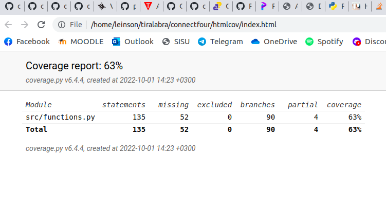

# Testausdokumentti
Ohjelmaa on testattu sekä manuaalisesti automatisoiduilla yksikkö- ja integraatiotesteillä läpi kehityksen.

## Yksikkö- ja integraatiotestaus

### Sovelluslogiikka
Sovelluslogiikasta vastaava tiedosto on tällä hetkellä Functions. Tämän tiedoston metodit on jaettu eri testiluokkiin: TestFunctions, TestCheckIfWin ja TestMiniMax.

### Testauskattavuus
Testauksen haarautumakattavuus on tällä hetkellä 63%. 

Näet viikkottaiset testikattavuusraportit dokumentaatio-kansion alakansiosta testikattavuus.

Käyttöliittymä on jätetty testikattavuuden ulkopuolelle. Käyttöliittymiä on tällä hetkellä kaksi: index.py toimii komentorivillä, ja ui.py pygamella graafisesti.

### Järjestelmätestaus
Järjestelmätestausta on suoritettu manuaalisesti. 

### Asennus
Sovellusta on testattu Linux-ympäristössä, missä sovellus on kehitetty.

### Toiminnallisuudet ja sovellukseen jääneet laatuongelmat 
Testausta on aloitettu, mutta testit eivät vielä kata koko ohjelmaa. Virhesyötöillä saa vielä sovelluksen kaatumaan. 
Kyseisiä asioita täydennetään sovelluksen kehityskaaren aikana. 
 
