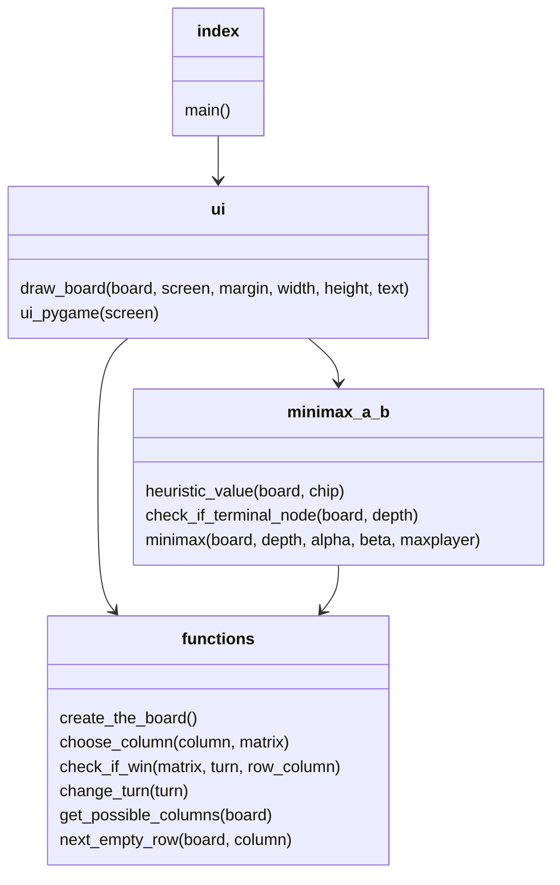

## Toteutusdokumentti

Connect Four - peli.

### Ohjelman yleisrakenne

Ohjelman rakenne koostuu karkeasti kahdesta kokonaisuudesta: käyttöliittymästä sekä sovelluslogiikasta. Näitä kahta on yritetty eristää toisisistaan mahdollisimman hyvin. Koko ohjelma on kirjoitettu pythonilla, ja toiminta pohjautuu eri funktio- ja metodikutsuihin. 

Käyttöliittymä on toteutettu pythonin kirjastolla Pygame, ja löytyy tiedostossa ui.py ja index.py. Sovelluslogiikka on toteutettu tiedostoon functions.py ja minimax.py. Functions.py ja minimax.py funktioita kutsutaan käyttöliittymästä. Minimax.py tiedostosta kutsutaan lisäksi suoraan functions.py funktioita. Koko ohjelma käynnistyy index.py tiedostosta, joka kutsuu käyttöliittymää.

Yllä oleva kaavio havainnollistaa tiedostojen sisältöä sekä niiden suhdetta toisiinsa. 

Kansio ui sisältää käyttöliittymään liittyviä tiedostoja, ja kansio entities_and_services sisältää sovelluslogiikkaan ja luokkiin liittyviä tiedostoja. Käyttöliittymästä kutsutaan entities_and_services luokan metodeja sovelluslogiikkaan liittyvissä toiminnoissa. 

Ohjelmassa käyttäjä pelaa tietokoneen tekoälyä vastaan, joka on toteutettu minimax algoritmilla jota on tehostettu alpha-beta karsinnalla. Tekoäly hyödyntää kyseistä algoritmia valitsemaan oman siirtonsa, priorisoiden sarakkeita keskeltäpäin. Käyttäjä valitsee itse sarakkeen, johon pudottaa oman nappulansa. Ohjelma tarkistaa jokaisen syötön jälkeen, onko voittoa havaittavissa. Jos voitto todetaan, peli päättyy. 

### Saavutetut aika- ja tilavaativuudet (m.m. O-analyysit pseudokoodista)

Aikavaativuus alpha-beta karsinnassa on yleisesti pseudokoodin mukaan pahimmassa tapauksessa O( $b^d$ ) (b= haarautuminen (branching factor) ja d=haun syvyys d vuorojen verran.), joka on siis sama kuin minimax funktion aikavaativuus. Koska olen kuitenkin optimoinut haarojen läpikäymistä käymällä sarakkeita keskeltä ulospäin, arvioin, että aikavaativuus on hyvin harvoin tuo minimaxin kaltainen. Tällöin kirjallisuuden mukaan, aikavaativuus onkin enemmän O( $\sqrt{b^d}$ ) luokkaa. Connect four pelissä on seitsemän saraketta johon voi tehdä siirron, jonka vuoksi b = haarautuminen on useimmiten 7. Toki silloin, kun pelilauta on täydempi, näitä haaroja tippuu pois. D = syvyydeksi tässä ohjelmassa on valikoitunut 6. Eli aikavaativuus on noin O( $\sqrt{7^6}$ )

Tilavaativuudesta: kyseessä on rekursiivinen algoritmi, joka ei vaadi varsinaisesti staattista isoa tietorakennetta vaan varaa dynaamisesti muistista tilaa sen edetessä, ja vapauttaa tilaa purkautuessa. Alfa-beta karsinnan myötä rekursion suuruuttakin saadaan rajoitettua. Varsinaista tilavaativuutta en pseudokoodeista algoritmille löytänyt.

Suorituskykyvertailu- ja testaus ei ollut tälle aiheelle oleellinen. 

### Työn mahdolliset puutteet ja parannusehdotukset

- Minimax algoritmia voisi vielä tehostaa paremmalla heurestiikalla. Esimerkiksi ottamalla mukaan pisteytykset myös 3-rivissä siirroille.
- Minimaxissa voisi myös rajata haun syvyyttä ottamalla huomioon yhden syvyyskerroksen keston, ja katkaisemalla minimax sen jälkeen, kun yhden kerroksen suorittaminen kestää esimerkiksi yli 10sek.
- Käyttöliittymää voisi parantaa antamalla käyttäjälle mahdollisuus valita vaikeustaso.

### Lähteet
https://tiralabra.github.io/2022_p1/fi/aiheet/

https://en.wikipedia.org/wiki/Minimax

https://en.wikipedia.org/wiki/Alpha%E2%80%93beta_pruning

https://jyx.jyu.fi/bitstream/handle/123456789/58204/1/URN%3ANBN%3Afi%3Ajyu-201805292875.pdf

https://www.youtube.com/watch?v=y7AKtWGOPAE&t=0s

https://dr0id.bitbucket.io/legacy/pygame_tutorial00.html

https://pygame.readthedocs.io/en/latest/1_intro/intro.html

https://www.fontspace.com/play-me-games-font-f42002
